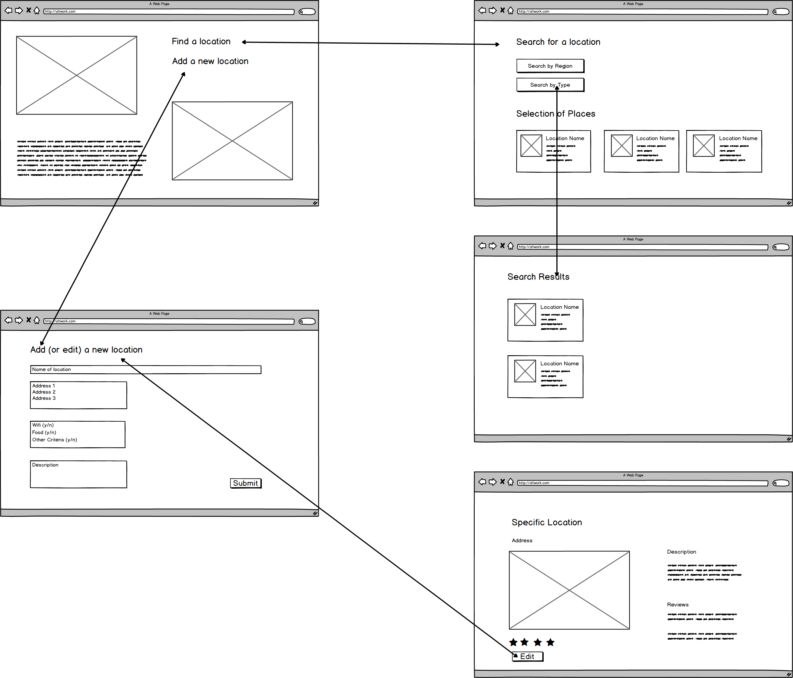
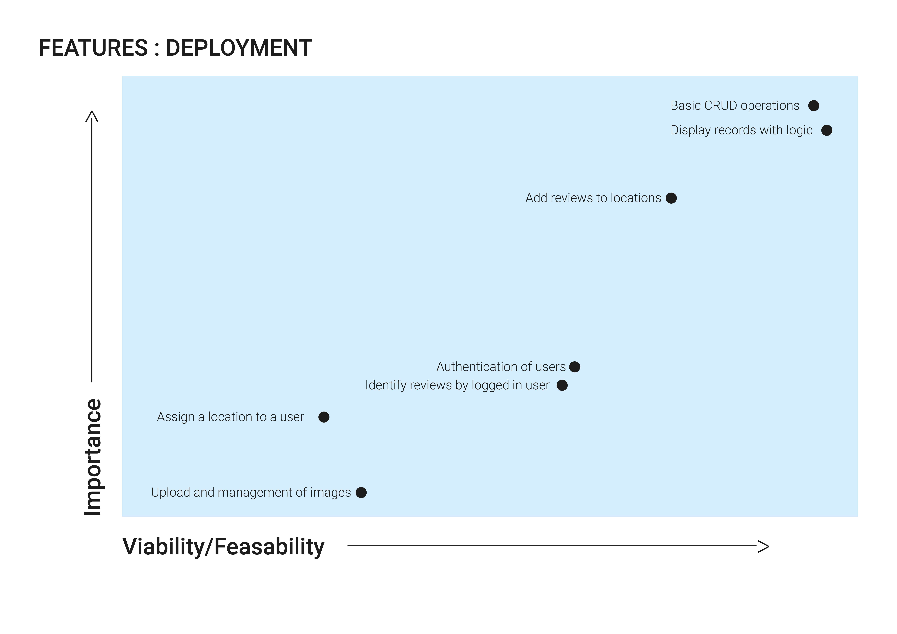

<h1>Alt_Work</h1>

Check this out 👉 >> https://alt-working.herokuapp.com

This project was first and foremost born out of a personal frustration when trying to find alternative places to work as a student studying remotely. 

After speaking to other students, freelancers and side-hustlers I found that the problem was a universal one. We all know there’s only so long that you can work in your front room, kitchen, bedroom, before you feel the inevitable cabin fever creeping in. 

The solution, on the surface, is simple - find a cafe, a library, or sunny park to work in for the day. Or rent a space in a co-working space, and mingle with likeminded people working toward the same thing as you. 

There are a few problems with this, however. The first, with the aforementioned cafes and restaurants, is that you may spend the best part of an hour travelling into town, only to find there are no plug sockets for you laptop, the Wi-Fi is either slow at best, or paid for, and the background noise means you cant hear yourself think let alone take a call. You're absolutely starving but you cant really take out the homemade sandwich you bought in with you, so you fork out another £8 for a coffee and a panini. 😡 

And it seems like a minor thing, but you have to limit the amount of times you go to the loo. Sounds trivial, but a big problem. If you've set up in a cafe or the local library in a central London there is no way you're getting up and leaving thousands of pounds in the form of hardware, but more importantly, thousands of hours of blood sweat and (many!) tears in the form of work just sitting on a table for someone to walk off with.
 

And there’s also no way that you're going to lose the only seat with the solitary plug socket to be taken by everyone else also facing the same problem. 

So what about co-working spaces? They are fantastic - you get to network, you can go to the loo as many times as you possibly can dream, drink gallons of decent coffee and get a few insta-worthy shots of the #digitalnomad dream*. 

*For a small fee of £350-500 per month. Which lets be honest, just isn’t an option for the majority of students, new freelancers and contractors.

So what if you could find out what you need to about a place- before you make all the effort of going there? All the stuff that matters to us? Like Wi-Fi, plugs, can I bring in my own food, or does it offer it at a reasonable price? Is it quiet, or if I need a place for a group session, is there lots of space and people who wont mind us getting excited and a bit loud? 

Enter Alt_Work. The resource made by a student/freelancer, for students and freelancers. A collaborative space where you can not only look up a location and what it offers, but also add a record for a location, so that others can benefit from what others have experienced, and put those precious hours and £'s to the best use you can.

<h1>UX</h1>

The following Use Cases summarise the four main groups of users that would use this app (names changed and stock photos used for anonymity purposes)
 

The functional specifications driven by these use cases are as follows:

- Search for locations by category

- Search for locations by location

- Search for locations by best_for

- Display information of each location :
	* Address
	* Category
	* Amenities (wifi etc)
    * Reviews from other users

- Users can upload a new location record

- Location owners can identify themselves as the owner of that location, and maintain business record information:
    * Business Name
    * Address
    * Email/Contact details
    * Profile/Display photo
    * Offers and sales available for users (BYGOF etc)
    

- Users can edit exising location records by way of adding a review

- If information on a location is incorrect users can edit and update

- To make changes or upload new records users must login - this will provide a means of tracking changes. 

<h3>Wireframes and Functional flows:</h3>

<h4>Desktop:</h4>

<h4>Mobile:</h4>

<h1>Features</h1>

Features deployed, and to be deployed are summarised in the following table

<h2>Existing Features</h2>

All the CRUD (Create, Read, Update and Delete) operations have been fully deployed in the app. 

The backend code and an easy to use frontend form have been created in "Add a new Alt_Work location" to allow users to add new records to the site.

Backend code groups and summarises the location on the site, based on region and type. This is displayed in a frontend page- the categories are then clickable to drill down into a filtered view based on region and type. 
Backend code will retrieve a list of recipes, filtered based on region and type, and orders them based on rating. A frontend page displays these results, and to shows summary statistics in the form of amount of matching results. 

A detailed view for each of the locations has been made. Editing and deleting of the location records is carried out on a separate page. Confirmation of deletion is implemented to prevent accidental deletion. 

<h2>Features Left to Implement (optional)</h2>

Authentication is yet to be implemented. Authentication will mean that reviews can be attributed to users, and also provide the basis for allowing location owners to 'claim' a location as theirs. 
A further development will be a page accessible only when logged in, where a location owner can maintain the business information held on a location. 
There would need to be some kind of verification process that the location owner is a genuine owner, otherwise there is the possibility that a user can falsely claim a location as their own, and incorrectly maintain or represent that location to the true owners detriment. In the absence of the resources to carry this out for each location, the editing of location details has been left open to the community, until a later date where verification is possible. 

The storage and management of pictures has also been left as a later implementation. An online hosting service could be used, however users may not be happy with their images being stored on an easy to access site such as flickr. The option then of a database is possible, but a Node.js or other package would be required for this to work with MongoDB (MongoDB is not intended for image storage). As the focus of this brief has been around CRUD operations and data manipulation this has been left for a later release. 

At the time of first release the rating is a single number defined in the new location/edit location form, to reflect the latest users experience. This would be improved to be an average rating of reviews, a behaviour more in line with other review sites.

<h1>Technologies Used</h1>

As a Flask application app logic has be written in Python 3. 

HTML, CSS, and JavaScript have be used to enhance the look and feel in the following ways.

Rendering of pages was achieved using a combination of HTML5 and CSS. The Bootstrap 4 framework has been employed to achieve a consistent look and feel across the app and device sizes. 

Javascript, and the JQuery  and ajax frameworks have been used to capture on-click events and modal popups, to enhance user experience and guide usage (prevent accidental deletion of records)

The Alt_Work app is data-driven and relies on a mix of structured and unstructured data. CRUD operations are carried out using NoSQL databse - specifically MongoDB.

<h1>Testing</h1>

<h3>UX testing (look and feel)</h3>
For this project, testing was carried out manually, both in the browser and with Google developer tools to test different screen sizes.

<h3>Code Validity</h3>
HTML was validated using the Markup Validation Service provided by The World Wide Web Consortium (W3C): https://validator.w3.org/

CSS was validated using the CSS Validation Service provided by The World Wide Web Consortium (W3C): https://jigsaw.w3.org/css-validator/

Throught development, the 'print()' command was used along with code breaks to understand what my code was doing and help bug fix. 

<h3>Maunal Testing with Users</h3>

To make sure each of the CRUD operations could be carried out on different devices and in different combinations, manual testing of adding, editing and deleting records was carried out by myself, and two to others (all the thanks to my boyfriend and sister - credits to be found in more detail below).

The following testing structure was used: 

<h3>Bugs and Problems</h3>
One issue not resolved in the submission for this project is the management of image files. MongoDB is not intended to store image files, so I initially searched for other means to store and access images.
Packages in Node.js, or perhaps online hosting were options, but out of the scope of this particular project. 

<h1>Deployment</h1>

GitHub has been used throughout this project to maintain version control as feature are added. After adding a new feature, the code is pushed to GitHub.

The site has been deployed using Heroku. The process for deploying to Heroku is as follows: 
- In your Heroku account, create a new app
- Under the setting tab in the app, reveal and change the 'config vars' to IP 0.0.0.0 and PORT 5000. 
- Ensure in your app you have in your app files in GitHub a Procfile with the following: 'web: python app.py', and you project requirements in a requirements.txt file. 
- In Heroku, in your app and under the 'deploy' tab, choose the GitHub deployment method. In the app connected to GitHub section find and select the app you wish to deploy. 
- Choose either automatic or manual deploys. In whichever you choose, select the branch in the GitHub repository you wish to deploy. 

Final deployed site is here: https://alt-working.herokuapp.com/

To run locally, create a new workspace in your local computer. Use $ git clone https://github.com/SammyDartnall10/alt_work.git to create a local copy of the code.
 

Install requirements with $ pip3 install -r requirements.txt

Run the app with $ python3 app.py

<h1>Credits</h1>

A huge thanks to my sister and boyfriend for helping me in many ways, but especially in helping me extensively test this site, to make sure all operations and key tasks can be carried out easy and correctly.

Thanks also to my mentors- previous and current - for helping me build my understanding of how python, the Flask framework and NoSQL databases work, providing direction and helping to squish those pesky bugs that keep popping up! 

<h1>Content</h1>

Descriptions for each of the locations was found through google searches of locations in the area. 

Reviews and information on wifi, plugs, food and bringing pets are entirely fictional, and made up by either myself or those assisting in testing.

An excel spreadsheet was created and then converted to CSV. This CSV file was then converted to JSON, so that location data could be uploaded in one go to MongoDB.

Images were from unsplash.com

